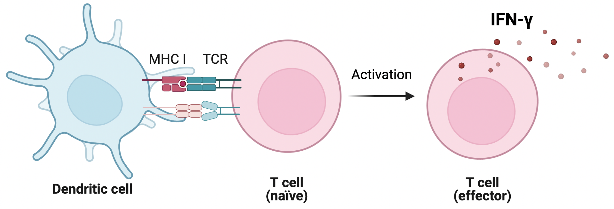

# PREDICTING PEPTIDE IMMUNOGENICITY WITH DEEP LEARNING ARCHITECTURES

This project was done in collaboration with DTU compute in the spring of 2022. 

### Abstract

This project explored different deep learning architectures (FFNN, CNN and RNN) to predict the immunogenicity of peptide:MHCI pairs in a pan-specific manner. Such a tool would be highly valuable in the development of new protein therapeutics as a cheap and quick alternative to current low throughput in vitro assays. Out of the models tested, it was found that an RNN architecture had the highest performance on the testing set with an AUC = 0.778 and auPR = 0.790. This model used two separate bidirectional LSTM encoding layers, which slightly outperformed the next best CNN architecture. Then through an occlusion sensitivity analysis, it was found that position 0 was the most important for the prediction of immunogenicity, which does not align with previous observations. This observation suggests a bias in the dataset resulting in the models not generalizing well outside the used dataset. Thus, the performances reported in this project may not be replicable on new data. Lastly, a noisy student setup was applied to the RNN architecture to attempt increasing the available pool of data by labelling previously unlabeled peptide:MHCI pairs. The results from this setup suggested that the model was able to increase the available dataset with unlabeled data. 

### The folders

#### data 

- ifng_true_parts is a folder in which you will find 10 partitions. These 10 partitions are filtered, preprocessed and balanced partitions made from IEDB data. 
    - All data in the partitions can also be found in ifng_true_balanced_w_parts_w_binding_scores_w_iedb.csv

- netMHCpan_results_ifng_true are the binding scores that netMHCpan predicted for all the peptides. These were used as a baseline. 

- IEDB_results_true.csv are the IEDB predictions, also used as a baseline. 

- blosum62 and aaindex are both used as encoding schemes. 

- formatted_hla2paratope_MHC_pseudo.dat are the paratope sequences of the HLA's in the data

- MHC_full.dat are the full MHC sequences 

- PCA_repr_aa.csv is the PCA representation of the AAindex database

- semi_supervised_data_w_binding_no_overlap_astrid.csv is the unlabelled data from IEDB that is used for the noisy student setup 

#### notebooks

All model structures used in the paper can be found in model_structures.py. 

Our hyperparameter optimization pipeline can be found in hyperparameter_optimization.ipynb. 

The code for the performance plots for our paper can be found in plots.ipynb. 

The noisy student setup can be run from the SemiSupervised_learning.ipynb. 

The pan models can be run via testing_pan.ipynb. In the code, we have marked where changes should be made to run another model (e.g. RNN or CNN).

The allele specific HLA-A*0201 RNN model can be run via testing_HLA.ipynb. 

#### scripts

Here, you will find scripts that we have used for various things, such as mergin our datasets. 

#### Other

plots is a simple folder for holding a few plots that we generate in the program. 

Both folders named "old" contain all data and notebooks we have used throughout the project. This got messy, but we wanted to make it available for anyone who wants to try to backtrace. 

